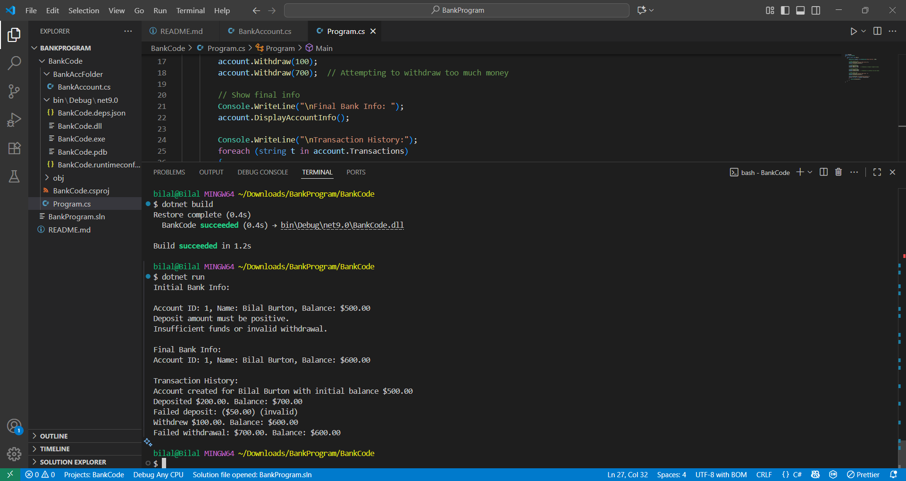

---------------------------------
# BankAccount Class Design
---------------------------------
## **UML Design**
---------------------------------
- accountId : int
- customerName : string
- balance : decimal
- transactions : List<string>
---------------------------------
+ AccountId : int { get; }
+ CustomerName : string { get; }
+ Balance : decimal { get; }
+ Transactions : List<string> { get; }
---------------------------------
+ BankAccount(customerName : string, initialBalance : decimal)
+ Deposit(amount : decimal) : void
+ Withdraw(amount : decimal) : void
+ DisplayAccountInfo() : void

------

## Test Cases

### **Success cases**
1. Create account with valid name and positive balance.
2. Deposit valid positive amount.
3. Withdraw valid amount within balance.
4. Transactions recorded correctly.

### **Failure cases**
1. Deposit negative or zero amount.
2. Withdraw more than balance.
3. Withdraw negative or zero.

------

## Output code:

